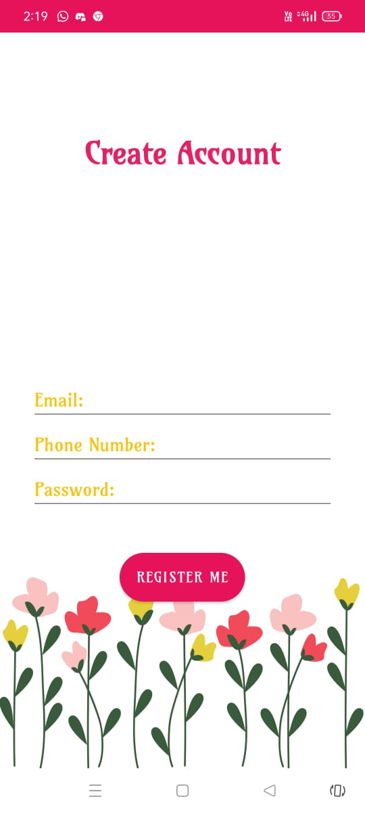
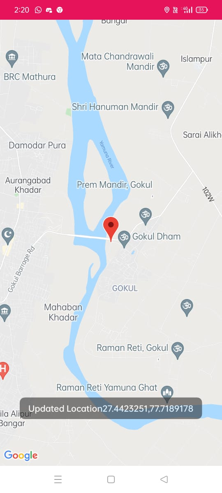
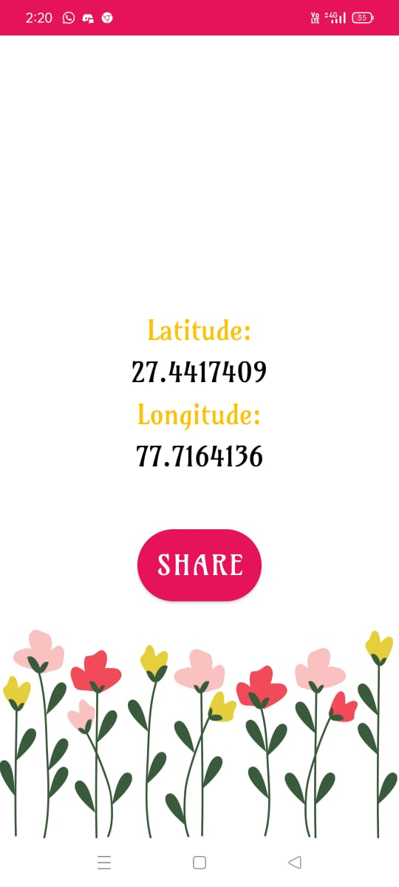
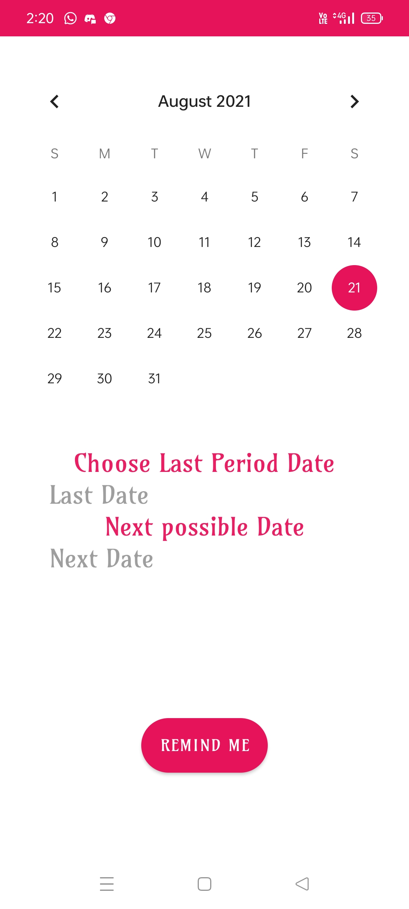

# Women Safe Zone - An Application for Women Safety

A complete women safety mechanism is required, to make the country more safe for women. For fulfilling one of those aspects, we have came up with a project- <b> Women SafeZone </b>  
Women SafeZone is an android application built for women saftey.
It tracks the location of the user, in order to provide help as soon as possible in the case of any emergency.

# Features:
- Location Tracking
- Location Sharing
- Police Alarm
- Period Tracker
 
# Technology Stack:
-Android Development Using Java

# Download APK from here (the link includes the presentation of the project):
https://drive.google.com/drive/folders/1rse0ubHFr7SMnrC8wKrMo3M7uSF6KsJH?usp=sharing

# Layout:
 &nbsp;  &nbsp;
   &nbsp;     &nbsp;  

# Contributors:

- [Neha Adnekar](https://github.com/Nehaadnekar)
- [Riya Mathur](https://github.com/Blitzcoder01)

# Contacts:
Feel free to contact us if you have any further queries, at:
<riya.mathur_cs18@gla.ac.in>, 
<neha.adnekar_cs18@gla.ac.in>, 
